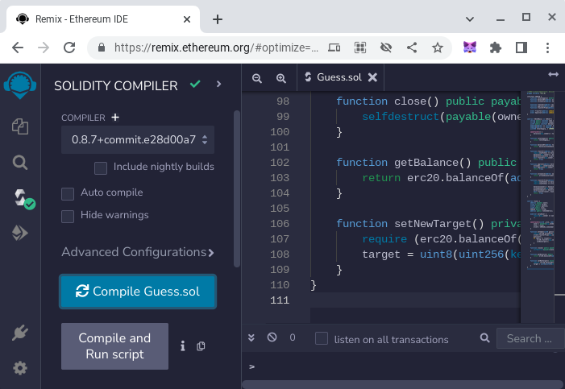
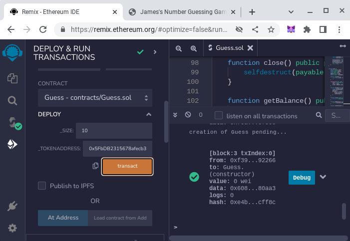
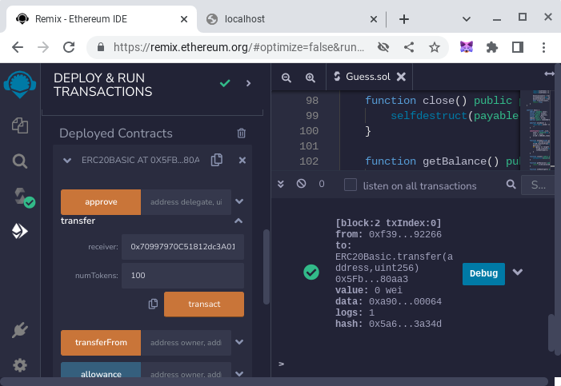
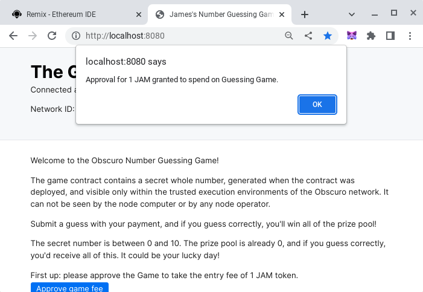
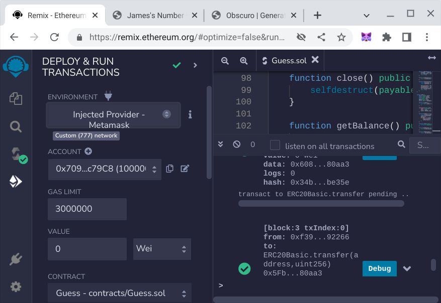
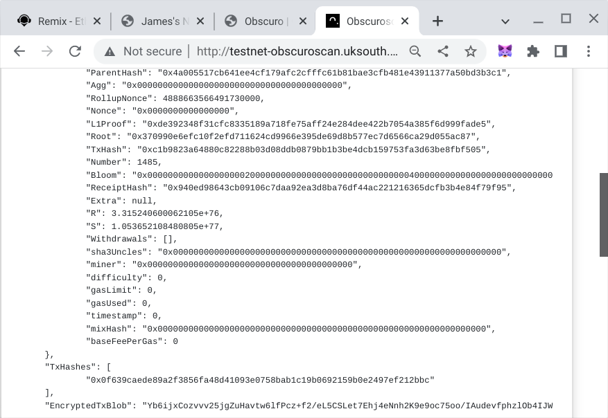

# Basic Sample Obscuro Project

## Introduction
This project demonstrates a basic Obscuro use case, which is a simple number guessing game. The contract generates a random secret number when it's deployed, which is never revealed to an operator or end-user because of the privacy benefits of Obscuro. The goal of the game is to guess this number, and each time an attempt is made, an entrance fee of 1 token is paid. If a user correctly guesses the number, the contract will pay out all of the accumulated entrance fees to them, and reset itself with a new random number.

Without Obscuro, it would be possible to look up the internal state of the contract and cheat, and the game wouldn't work. 

The contract functionality comes with two contracts in the `Guess.sol` file; a basic ERC20 contract which allows the user to hold assets and pay the entrance fee to the game, and the game contract itself. This includes a test for that contract, a sample script that deploys that contract, and an example of a task implementation, which simply lists the available accounts.

In developing this game, the following tools were used:
* Git (Source code versioning tool)
* NPM (Node Package Manager, available on many platforms)
* NPX (Node Package Execution, used as a runtime for Hardhat tasks)
* Hardhat (a complete Ethereum compiler and test deployment environment)
* Remix IDE (a browser-based contract deployment and low-level interaction tool)
* Ethers.js (a Web3 Javascript library)
* Vite (a packaging library, handy for compiling Typescript)
* Metamask (a popular wallet for crypto tokens and smart contract interaction)
* Obscuro Testnet (an open, permissionless test network for Obscuro)
* Obscuro Wallet Extension (a proxy for an Obscuro node, which handles encryption for all data between the wallet and the network)

## Environment Setup
The following steps are required:
0. Install git, outside the scope for this project.
1. Clone this repository into a suitable folder.
```shell
git clone 
```
2. Install NPM and NPX, and ensure they are running correctly. This is outside the scope of this project.
3. Install NPM packages specified in `package.json` by running:
```shell
npm install
```
4. The contract is deployed initially to a Hardhat network. Hardhat and its dependencies will have been  installed in the previous step. More details are available at https://hardhat.org/hardhat-runner/docs/getting-started#overview. Once Hardhat is installed, try running some of the following tasks:
```shell
npx hardhat accounts
npx hardhat compile
npx hardhat clean
npx hardhat test
npx hardhat node
node scripts/sample-script.js
npx hardhat help
```
5. Starting Hardhat with `npx hardhat node` will create 2 accounts. The first is used for the application developer and the second is used for an end-user. Take a note of the private keys generated for these (note that these private keys are well-known!).


6. Set up Metamask with the Hardhat network on `http://127.0.0.1:8545/`. 


7. Import the accounts into Metamask using the private keys. 


8. Rename the accounts to be more user-friendly.


## Application Development
This part of the process is standard Ethereum application development.
1. Launch Remix from `https://remix.ethereum.org/`


2. Open the contract `Guess.sol` in Remix, and compile it using a Solidity compiler > 0.8.0. 



3. Switch to the Networks tab in Remix, and select the Hardhat network environment.


4. Deploy the ERC20 contract to Hardhat using the `App Developer` account, identified by its address, and take a note of the contract address.


5. Deploy the Guess contract to Hardhat using the `App Developer` account, and take a note of the contract address. The Guess contract constructor takes a `_size` value, which is the range for the random number to be generated within, and a `_tokenAddress` parameter, which is the address of the ERC20 contract deployed in the previous step. The Guess contract needs this in order to know where to take the game fee from.



6. Confirm and update the contract addresses `ERC20_ADDRESS` and `GUESS_ADDRESS` in [index.ts](./src/index.ts).

7. Switch to the transaction tab on Remix. Set up the account balances for the end-user by transferring some tokens, using the application developer account and the `transfer` function of the ERC20 contract and specifying the end-user as the recipient. Check the token balance of the end-user using the `balanceOf` function.



8. Start the user interface for the game, ignoring warnings if possible. Note that the user interface has been updated and does not look exactly like these screenshots.


9. The app is not initially connected to Metamask, and when the page first loads, it should prompt Metamask to pop up and seek connection wth the end-user account. Approve this.


10. After connection, the user interface should now show the contract address, the range of the random number, and the number of guesses so far.


11. Click on the "Approve game fee" button to allow the Guess contract to take the game entrance fee from the end-user's account. Metamask will ask for end-user account to sign a transaction to call the `approve` function, specifying the Guess contract address as the delegate.




12. Finally, have a go at guessing the number!


## Transitioning to Obscuro Testnet
Because Obscuro uses the same tools and EVM as Ethereum itself, it should be possible to replay the previous steps with Obscuro's Testnet.

1. Start up the wallet extension. Follow instructions at (docs.obscu.ro/testnet/wallet-extension)[https://docs.obscu.ro/testnet/wallet-extension.html]. The wallet extension is started with configuration to connect to Testnet, and to Metamask, it acts like the network itself. 


3. When a viewing key is requested, Metamask will ask for permission to connect to the wallet extension "network", and then request the user to sign a "generate viewing key" transaction.


4. Now Metamask is configured, and the wallet extension "network" is available to connect to in Remix. Remix is configured to use a custom injected network.



5. Deploy the ERC20Basic contract (repeat step 4 from earlier).


5. Deploy the Guess contract to Obscuro testnet using the `App Developer` account, and take a note of the contract address. As before, the Guess contract constructor takes a `_size` value, which is the range for the random number to be generated within, and a `_tokenAddress` parameter, which is the address of the ERC20Basic contract deployed in the previous step. The Guess contract needs this in order to know where to take the game fee from.


Take note of the transaction hash `0x7d1decd746590cc9214f9ab1b23837c7be785b438877ca89bc223f45ef8c5a6a`. This can be used to view the transaction on ObscuroScan.

6. Confirm and update the contract addresses `ERC20_ADDRESS` and `GUESS_ADDRESS` in [index.ts](./src/index.ts).

7. For this deployment, use a single user and account for deployment and game playing.

8. Start the user interface for the game, and click on the "Approve game fee" button to allow the Guess contract to take the game entrance fee from the end-user's account. Metamask will ask for end-user account to sign a transaction to call the `approve` function, specifying the Guess contract address as the delegate.


12. Finally, have a go at guessing the number! Note how the data presented by Metamask to the user is not yet encypted: that happens when Metamask signs the transaction and sends it to the wallet extension "network", allowing the wallet extension to encrypt it.


13. Check the guess transaction on ObscuroScan. Note how the transaction visible in public is encrypted.



14. Check the facility for viewing individual transactions using the transaction search box, and note how (for now) the transaction is decrypted to allow developers to confirm correct behaviour of the network. The transaction payload includes the signature of the method being called, and the parameters appended. In this case, you can see that the number 3 was submitted as a guess.


